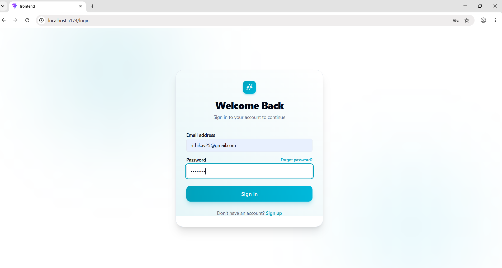
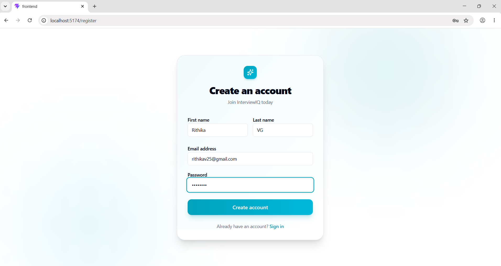
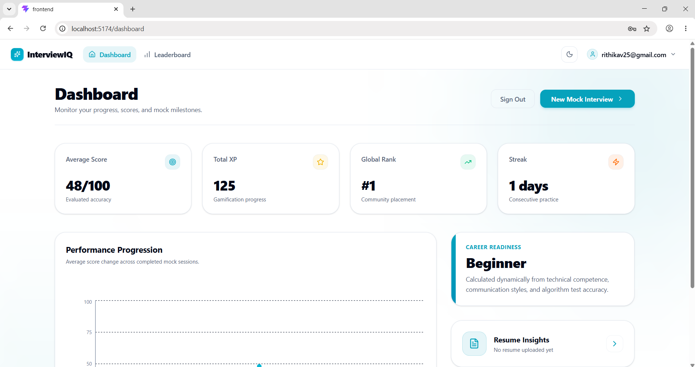
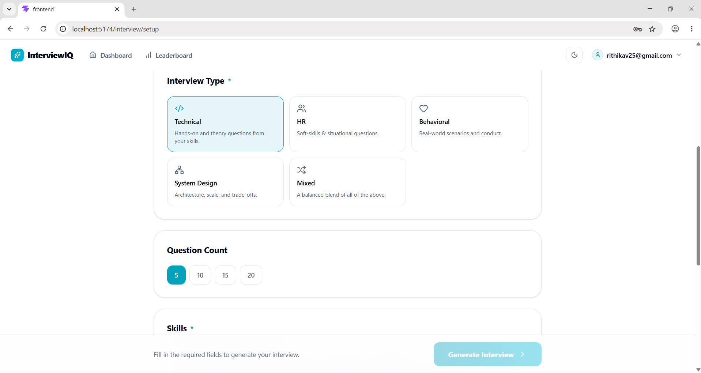
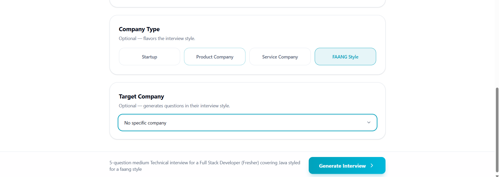
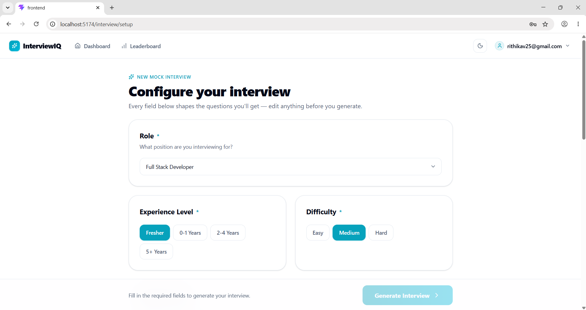
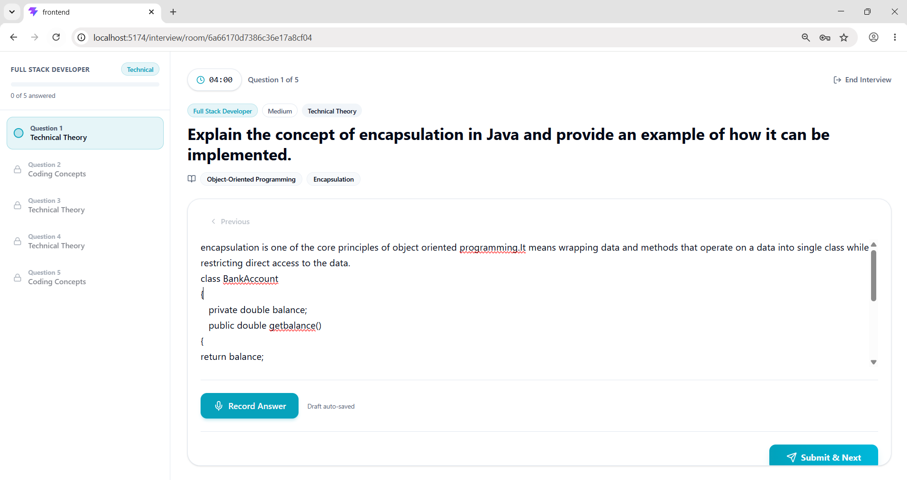
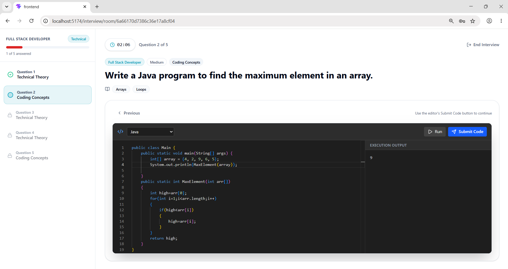
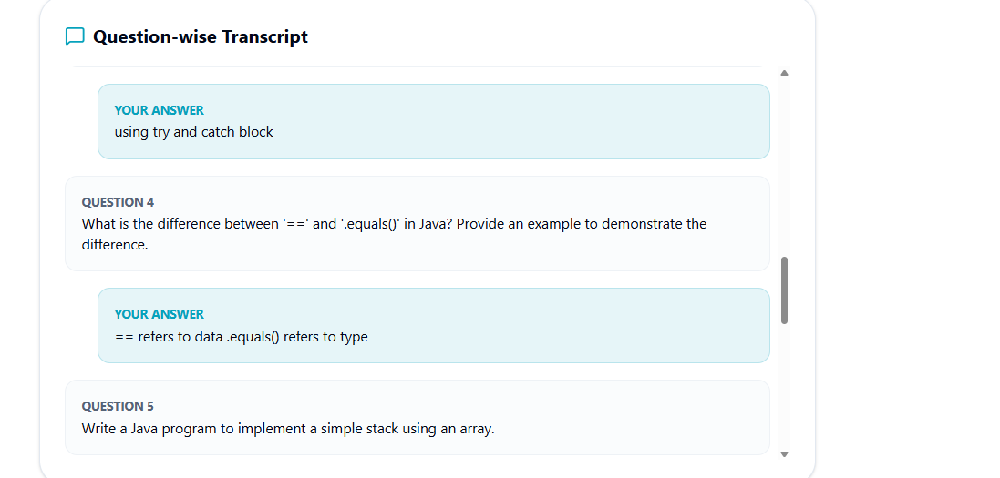
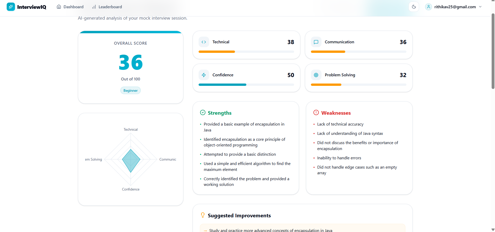

# InterviewIQ

**Practice interviews. Get instant AI feedback. Land the job.**

AI-powered mock interview platform for practicing interviews, getting instant AI-driven feedback, and tracking progress over time.


## Features
-`JWT-based authentication (register/login)
-Resume upload and AI-driven resume analysis
-AI-generated interview questions (role-, resume-, and company-specific, with follow-ups)
- Live interview sessions with AI evaluation and scoring
- Interview reports exported as PDF
- Gamification: achievements and leaderboard
-  Admin dashboard with platform-wide analytics

## Tech Stack

**Backend** (`backend-springboot/`)
- Java 21, Spring Boot (Web, Security, Validation, Data MongoDB)
- MongoDB
- JWT auth (jjwt)
- OpenAI-compatible LLM API for question generation and evaluation
- PDF generation (OpenPDF / PDFBox)
- Cloudinary for file storage
- springdoc-openapi for API docs

**Frontend** (`frontend/`)
- React 19 + TypeScript, Vite
- Redux Toolkit + React Query
- Tailwind CSS
- Recharts, Monaco Editor

## Getting Started

### Backend

```bash
cd backend-springboot
mvn spring-boot:run
```

Configure via environment variables (see `src/main/resources/application.yml`):

| Variable | Description |
|---|---|
| `MONGO_URI` | MongoDB connection string |
| `JWT_SECRET` / `REFRESH_TOKEN_SECRET` | JWT signing secrets |
| `AI_BASE_URL` / `AI_API_KEY` / `AI_MODEL` | LLM API config (OpenAI-compatible; defaults to Groq) |
| `CLOUDINARY_CLOUD_NAME` / `CLOUDINARY_API_KEY` / `CLOUDINARY_API_SECRET` | Cloudinary credentials |

Or run everything with Docker:

```bash
cd backend-springboot
docker-compose up
```

### Frontend

```bash
cd frontend
npm install
npm run dev
```

## Screenshots

| | |
|---|---|
| **Login**  | **Register**  |
| **Dashboard**  | **Interview Type**  |
| **Company Type Interview**  | **Configure Interview**  |
| **Interview Question**  | **Coding Interview**  |
| **Question-wise Transcript**  | **Results**  |

## Project Structure

```
backend-springboot/   Spring Boot API (controllers, services, models, security)
frontend/             React + TypeScript client
```
